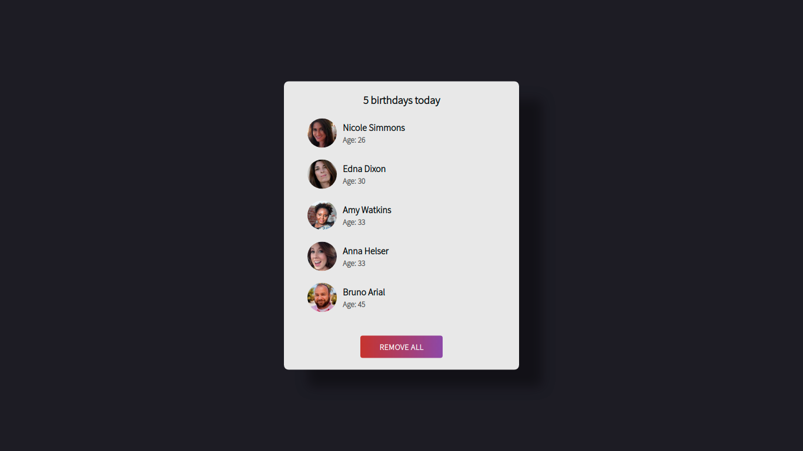

# birthday-reminder

Birthday reminder made with React, uses `useState` hook.

## How to run

1. Download / Clone the repo files.
2. Go into the directory and run `npm install`
3. After installing all the packages, run `npm start` and go to `http://localhost:3000`

## About

This was my first React project, I'm still learning it. If something is wrong in the code, please tell me.

## Images

